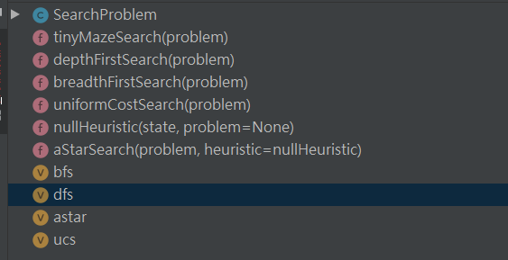
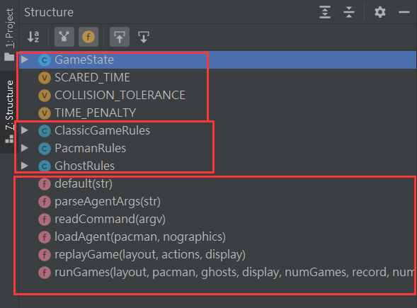
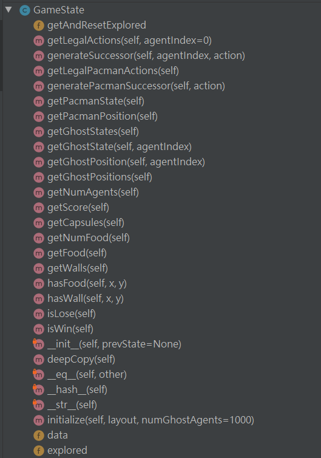

# AI_lesson_labs
hitsz 2020年人工智能实验题目 

# 实验一

pass

# 实验二

来源于UC Berkeley的题

我们需要编辑的文件为`search.py`和`searchAgents.py`。

需要参考的文件为`pacman.py`, `game.py`, `util.py`, 因此我们先了解一下文件关系。

## 文件内容

### `search.py`

这个文件里我们要完成的是这几个搜索算法。

### `searchAgents.py`

### `pacman.py`

该文件被注释划分成了三个部分, 在pycharm中的侧边栏打开structure视图, 对照代码中的注释可以看到他的划分

代码中的注释也对这三部分是否要看标注了重要度: 第一部分有一部分要看; 第二部分可看可不看; 第三部分必须要看。

下面看一下`GameState`类中有什么方法:

看函数名字可以知道这些函数多为获取某些状态的函数。

### `game.py`

### `util.py`